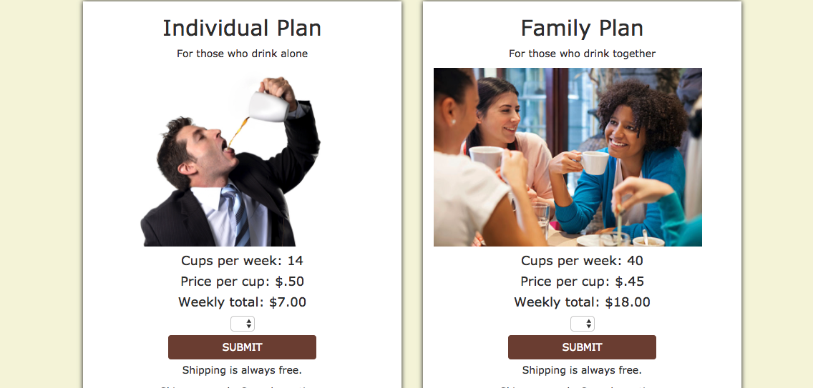

# E-Commerce site 
### Shopping for beverages has never been more zen.

## Built with:
```
- HTML
- CSS
- Bootstrap
- Compass/SASS
- AngularJS
- Express
- NodeJS
- Mongo
```
##This coffeee/tea subscription site was built using Node.js, Express, MongoDB, Mongoose and AngularJS. 
###Front-end : HTML5, CSS3 and AngularJS
###Back-end : Express and MongoDB/Mongoose, Node.js
###Security: Bcrypt and token authentication.
###Payment Processing: Stripe

## Sample Code
###Customer has options, weekly or monthly:

```

	$scope.weekly = function(){
		$http.post(apiPath + '/options', {
			token: $cookies.get('token'),
			frequency: 'Weekly',
			total: 7.00
		}).then(function successCallback(response){
			if(response.data.post == 'optionAdded'){
				$scope.choiceMade = true;
				$timeout(function(){
					$location.path('/delivery');
				}, 1500);
			}	
		}, function errorCallback(response){
			console.log(response);
		})
	};

	//if a customer selects monthly option
	$scope.monthly = function(){
		$http.post(apiPath + '/options', {
			token: $cookies.get('token'),
			frequency: 'Monthly',
			total: 18.00
		}).then(function successCallback(response){
			if(response.data.post == 'optionAdded'){
				$scope.choiceMade = true;
				$timeout(function(){
					$location.path('/delivery');
				}, 1500);
			}
		}, function errorCallback(response){
			console.log(response);
		})
	}
```