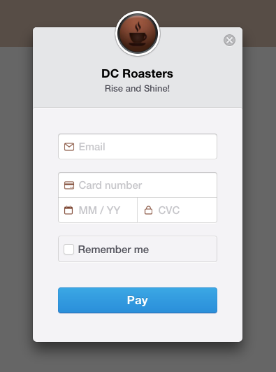

# E-Commerce site 
### Shopping for beverages has never been more zen.

## Built with:
```
- HTML
- CSS
- Bootstrap
- Compass/SASS
- AngularJS
- Express
- NodeJS
- Mongo
```
##This coffeee/tea subscription site was built using Node.js, Express, MongoDB, Mongoose and AngularJS. 
###Front-end : HTML5, CSS3 and AngularJS
###Back-end : Express and MongoDB/Mongoose, Node.js
###Security: Bcrypt and token authentication.
###Payment Processing: Stripe

## Sample Code
###Customer has options, individual or family plan:

```
//This option to make it a subscription site:
	$scope.individualPlan = function(){
		console.log("Indiv plan selected");
		console.log($cookies.get('username'));
		$http.post(apiPath + '/options', {
			token: $cookies.get('token'),
			plan: "Individual",
			total: 7.00
		}).then(function successCallback(response){
			$location.path('/delivery');	
		}, function errorCallback(response){
			console.log(error);
			console.log(response);
		})
	};

	//if a customer selects family option
	$scope.familyPlan = function(){
		console.log("Fam plan selected");
		$http.post(apiPath + '/options', {
			token: $cookies.get('token'),
			plan: "Family",
			total: 18.00
		}).then(function successCallback(response){
			$location.path('/delivery');
		}, function errorCallback(response){
			console.log(response);
		})
	}
```
### Stripe:

### Update:
#### I'll be honest, cookies aren't saving tokens anymore. I'm not sure why after my new OS update (still researching, I expect progress soon). I wanted to get a nice checkout screenshot (like from before, I should have taken the screenshot then!)...